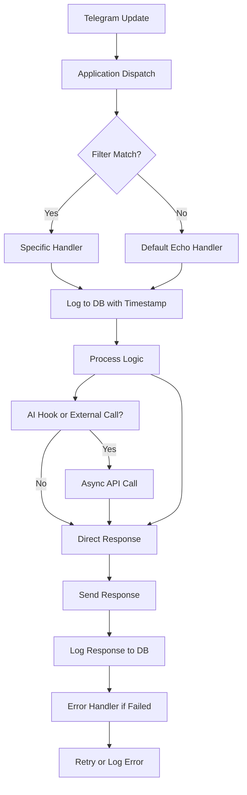

# Telegram Bot Architecture Design

## Overview

This document outlines the architecture for a robust, extensible Python Telegram bot designed for local development and running. The bot leverages the `python-telegram-bot` library (v20+), following best practices from the library documentation: secure token handling via environment variables, polling for updates in local environments, asynchronous handlers for efficient update processing, message routing with filters (e.g., command, text, callback), inline keyboards for user interactions, SQLite3 for persistent storage of message history and responses with timestamps, comprehensive error handling with retries, and extensibility through modular handlers, Mini Apps integration, and hooks for AI services or proxies.

### Key Requirements Addressed
- **Local Running**: Uses polling mode for development; webhook support can be added for production.
- **Message Timestamps and DB Storage**: All incoming messages and bot responses are logged to SQLite3 with UTC timestamps for accessibility and auditing.
- **Server-Side Script Execution**: Secure `/run_script` command executes Python scripts on the server (with sandboxing and validation).
- **Automatic Location Sharing**: `/share_location` command requests and sends live location updates.
- **Extensibility**: Hooks for AI answering (e.g., async API calls to external services like OpenAI), universal coupling for future features (e.g., phone scripts via Telegram Mini Apps or proxy endpoints).
- **Security and Robustness**: Environment variables for secrets, input validation, rate limiting, logging, and retry mechanisms for API calls.
- **Scalability**: Modular design allows easy addition of handlers, processors, or integrations without core changes.

The system is built in Python 3.9+, ensuring async compatibility and modern features.

## Modules

The project follows a modular structure for maintainability and extensibility:

- **bot.py** (Main Entry Point): Initializes the bot, sets up the application with token from `.env`, configures polling, registers handlers, and starts the event loop. Includes global error handler and shutdown logic.
- **config.py**: Loads environment variables (e.g., `BOT_TOKEN`, `DB_PATH`) using `python-dotenv`. Defines constants like rate limits and retry policies.
- **db/** (Database Layer):
  - `db.py`: SQLite3 wrapper for CRUD operations. Schema includes tables for `messages` (user_id, chat_id, message_id, timestamp, text/content, is_from_bot) and `scripts` (for executed scripts history).
  - `models.py`: SQLAlchemy-like ORM classes (or dataclasses) for Message and ScriptLog entities.
- **handlers/** (Message Routing and Processing):
  - `__init__.py`: Registers all handlers with the bot application.
  - `basic.py`: Handles start/help commands, echo for non-commands.
  - `script.py`: `/run_script` handler – validates input, executes script securely (e.g., via `subprocess` with restrictions), logs output to DB.
  - `location.py`: `/share_location` handler – uses `request_location` keyboard, handles live location sharing via `send_location`.
  - `ai.py`: Abstract base for AI hooks – async processor class (e.g., `AIProcessor`) that can be subclassed for external API calls (e.g., GPT integration).
  - `callback.py`: Handles inline keyboard callbacks (e.g., confirmations for scripts or locations).
- **utils/**:
  - `logger.py`: Configures structured logging (e.g., with `logging` module and timestamps).
  - `validators.py`: Input sanitization (e.g., script code limits, user permissions).
  - `rate_limiter.py`: Simple token bucket for per-user rate limiting.
- **requirements.txt**: Lists dependencies: `python-telegram-bot`, `python-dotenv`, `sqlite3` (built-in).
- **.env**: Template for secrets (e.g., `BOT_TOKEN=your_token_here`).
- **run.py**: Script to start the bot (calls `bot.py` main).

This structure separates concerns: core bot orchestration, business logic in handlers, data persistence, and utilities.

## Feature Specifications

### Basic Setup
- Bot initializes with `Application.builder().token(token).build()`.
- Uses `Application.run_polling()` for local dev.
- Global filters: Command, Text, CallbackQuery.
- Async context for all handlers to handle concurrent updates.

### Message Logging with Timestamps
- Every update (message or callback) triggers a DB log via `db.log_message(user_id, chat_id, message, timestamp=datetime.utcnow(), is_from_bot=False)`.
- Bot responses are logged similarly with `is_from_bot=True`.
- Timestamps stored as ISO 8601 UTC strings for queryability (e.g., via SQL `WHERE timestamp > ?`).

### /run_script Command
- Filter: `Command("run_script")`.
- Validates user input (e.g., code length < 1000 chars, no dangerous imports like `os.system` via regex/static analysis).
- Executes in isolated subprocess: `subprocess.run(["python", "-c", code], capture_output=True, timeout=30)`.
- Logs input/output to DB; sends result or error to chat.
- Security: Run in restricted environment (e.g., no file I/O); admin-only via user_id check.

### /share_location Command
- Filter: `Command("share_location")`.
- Sends message with inline keyboard: "Share Location" button using `InlineKeyboardButton` with `request_location=True`.
- On callback: Bot requests location via `request_location(update, context)`.
- Handles `Location` update: Sends live location with `send_location(latitude, longitude, live_period=300)` for 5-min sharing.
- Logs location data (lat/lon, timestamp) to DB (anonymized if needed).

### Hooks for AI
- In `ai.py`: Abstract `AIProcessor` class with `async process_message(text: str) -> str`.
- Example impl: `OpenAIProcessor` calls external API asynchronously.
- Integrated in `basic.py` echo handler: If text starts with "/ai", route to processor, log query/response.
- Extensible: Subclass for other services; hooks can be plugged into any handler.

### Data Flow
1. **Update Received**: Telegram API → Polling loop → Application.dispatch(update).
2. **Handler Matching**: Filters route to specific handler (e.g., CommandHandler, MessageHandler).
3. **Processing**: Handler extracts data, logs to DB (always), executes logic (e.g., script run, location request, AI hook).
4. **Response**: Send message/location via `context.bot.send_*`, log response to DB.
5. **Error Handling**: Try-except in handlers; retry failed API calls (e.g., with `tenacity` if added); log errors.
6. **Extensibility Point**: Pre/post hooks in handlers for custom processing (e.g., proxy to Mini App).

Rate limiting applied per handler (e.g., 5 cmds/min per user).

## Diagram (Text-Based)

### High-Level Module Diagram (ASCII)
```
+-------------+       +-------------+       +-------------+
|   Telegram  | ----> |   bot.py    | ----> |  Handlers   |
|    API      |       | (Core App)  |       |  (script,   |
+-------------+       +-------------+       |   location, |
                                             |     ai)     |
                                             +-------------+
                                                      |
                                                      v
+-------------+       +-------------+       +-------------+
|   config.py | <---- |   utils/    | <---- |   db/       |
| (.env load) |       | (logger,    |       | (sqlite3,   |
+-------------+       |  rate limit)|       |  models)    |
                      +-------------+       +-------------+
```

### Data Flow Diagram (Mermaid)


Note: Mermaid avoids double quotes and parentheses in labels for parsing.

## Implementation Notes
- **Async Best Practices**: All handlers use `async def`; use `await context.bot.send_message()` for responses.
- **DB Schema Example**:
  - `messages`: id (PK), user_id, chat_id, timestamp (TEXT), content (TEXT), direction (FROM_USER/FROM_BOT).
  - Indexes on user_id, timestamp for queries.
- **Security**: Never hardcode token; validate all user inputs; use `context.user_data` for session state.
- **Robustness**: Implement `Application.add_error_handler()` for uncaught exceptions. Use exponential backoff for retries (e.g., via library's built-in).
- **Extensibility**: Handlers as plugins – load dynamically from `handlers/` dir. For Mini Apps: Use `send_invoice` or web app links. For proxies: Abstract `ProxyHandler` class.
- **Testing**: Unit tests for handlers (mock Application); integration with test DB.
- **Deployment**: For prod, switch to webhook; add APScheduler for periodic tasks (e.g., location reminders).
- **Scalability**: SQLite3 for local; migrate to PostgreSQL for multi-instance. Use Redis for rate limiting in distributed setups.
- **Guidelines Compliance**: Answer callbacks promptly (<1s); validate data (e.g., location coords); handle all update types (messages, edits, etc.).

This design serves as the source of truth for implementation, ensuring modularity and adherence to Telegram Bot API best practices.